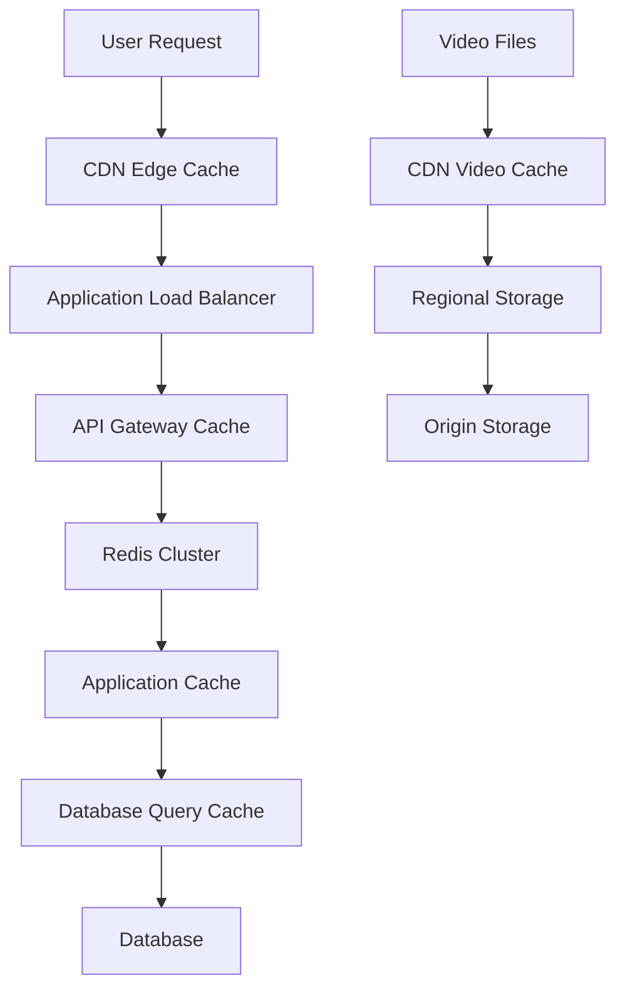

# Advanced Caching Strategy
## VideoStream Pro - YouTube Alternative Platform

### Overview
A comprehensive multi-layer caching strategy designed to minimize latency, reduce database load, and provide YouTube-level performance for video streaming and user interactions.

## 1. Multi-Layer Caching Architecture



## 2. CDN-Level Caching

### Video Content Caching
```yaml
video_caching:
  edge_locations: "200+ global locations"
  
  cache_rules:
    video_segments:
      ttl: "365 days"
      cache_key: "video_id + quality + segment_number"
      purge_trigger: "video_update_or_delete"
    
    thumbnails:
      ttl: "30 days"
      cache_key: "video_id + thumbnail_type + size"
      compression: "webp_with_fallback"
    
    video_metadata:
      ttl: "1 hour"
      cache_key: "video_id + user_context"
      vary_by: "authorization_header"

  cache_behaviors:
    popular_content:
      cache_everywhere: true
      preload_regions: "all_tier1_tier2"
      
    trending_content:
      cache_everywhere: true
      preload_regions: "all_regions"
      priority: "high"
      
    new_content:
      cache_on_request: true
      preload_regions: "origin_region"
      
    old_content:
      cache_lazily: true
      cleanup_after: "90_days_no_access"
```

### Static Asset Caching
```javascript
const staticAssetCaching = {
  javascript: {
    ttl: '30 days',
    compression: 'brotli',
    versioning: 'hash_based',
    cache_key: 'file_path + content_hash'
  },
  
  css: {
    ttl: '30 days',
    compression: 'brotli',
    minification: true,
    cache_key: 'file_path + content_hash'
  },
  
  images: {
    ttl: '7 days',
    formats: ['webp', 'avif', 'jpg'],
    responsive: true,
    cache_key: 'image_path + size + format'
  },
  
  fonts: {
    ttl: '365 days',
    compression: 'brotli',
    cors_headers: true
  }
}
```

## 3. Redis Cluster Caching

### Cluster Configuration
```yaml
redis_cluster:
  nodes: 6
  replication: "master-slave pairs"
  consistency: "eventual"
  
  sharding_strategy:
    method: "consistent_hashing"
    key_distribution: "user_id and content_id based"
    
  memory_management:
    max_memory: "8GB per node"
    eviction_policy: "allkeys-lru"
    persistence: "AOF + RDB snapshots"
```

### Session Management
```javascript
const sessionCaching = {
  user_sessions: {
    ttl: '24 hours',
    sliding_expiration: true,
    storage: 'redis_cluster',
    key_pattern: 'session:{user_id}:{session_id}',
    data: {
      user_info: 'basic_profile',
      preferences: 'viewing_settings',
      auth_tokens: 'jwt_refresh_tokens',
      activity: 'recent_actions'
    }
  },
  
  oauth_tokens: {
    ttl: '1 hour',
    key_pattern: 'oauth:{provider}:{user_id}',
    refresh_strategy: 'background_refresh'
  },
  
  rate_limiting: {
    ttl: '1 hour',
    key_pattern: 'rate_limit:{ip}:{endpoint}',
    sliding_window: true
  }
}
```

### Content Caching
```javascript
const contentCaching = {
  video_metadata: {
    ttl: '1 hour',
    key_pattern: 'video:{video_id}',
    invalidation: 'on_update',
    data: {
      basic_info: 'title, description, duration',
      stats: 'views, likes, comments_count',
      creator: 'channel_info',
      thumbnails: 'url_variants'
    }
  },
  
  user_profiles: {
    ttl: '30 minutes',
    key_pattern: 'user:{user_id}',
    invalidation: 'on_profile_update',
    data: {
      public_info: 'display_name, avatar, bio',
      stats: 'subscriber_count, video_count',
      verification: 'verified_status'
    }
  },
  
  playlists: {
    ttl: '15 minutes',
    key_pattern: 'playlist:{playlist_id}',
    data: {
      metadata: 'title, description, video_count',
      video_list: 'ordered_video_ids',
      permissions: 'visibility, collaborators'
    }
  },
  
  comments: {
    ttl: '5 minutes',
    key_pattern: 'comments:{video_id}:{page}',
    pagination: 'cursor_based',
    sorting: 'top, newest, oldest'
  }
}
```

## 4. Application-Level Caching

### In-Memory Caching
```javascript
const applicationCache = {
  categories: {
    storage: 'in_memory',
    ttl: '1 hour',
    preload: true,
    key: 'categories:all'
  },
  
  trending_videos: {
    storage: 'in_memory',
    ttl: '15 minutes',
    key_pattern: 'trending:{region}:{category}',
    background_refresh: true
  },
  
  search_suggestions: {
    storage: 'in_memory',
    ttl: '30 minutes',
    key_pattern: 'suggestions:{query_prefix}',
    max_entries: 10000
  },
  
  user_preferences: {
    storage: 'per_request',
    ttl: 'request_lifetime',
    key_pattern: 'user_prefs:{user_id}'
  }
}
```

### Computed Results Caching
```javascript
const computedCache = {
  recommendation_engine: {
    ttl: '2 hours',
    key_pattern: 'recommendations:{user_id}:{context}',
    contexts: ['homepage', 'watch_next', 'search_related'],
    invalidation: 'user_behavior_change'
  },
  
  analytics_aggregates: {
    ttl: '1 hour',
    key_pattern: 'analytics:{metric}:{timeframe}:{entity_id}',
    metrics: ['views', 'engagement', 'revenue'],
    timeframes: ['hourly', 'daily', 'weekly']
  },
  
  search_results: {
    ttl: '30 minutes',
    key_pattern: 'search:{query_hash}:{filters}:{page}',
    invalidation: 'new_content_indexed'
  }
}
```

## 5. Database Query Caching

### PostgreSQL Query Caching
```sql
-- Query result caching configuration
SET shared_preload_libraries = 'pg_stat_statements, pg_prewarm';
SET track_activity_query_size = 4096;
SET pg_stat_statements.track = 'all';

-- Connection pooling with PgBouncer
-- Database-level caching for frequently accessed data
CREATE MATERIALIZED VIEW popular_videos_cache AS
SELECT v.id, v.title, v.views_count, v.published_at, u.username
FROM videos v
JOIN users u ON v.creator_id = u.id
WHERE v.status = 'published'
AND v.views_count > 1000
ORDER BY v.views_count DESC;

-- Refresh materialized views every hour
SELECT cron.schedule('refresh-popular-videos', '0 * * * *', 
  'REFRESH MATERIALIZED VIEW CONCURRENTLY popular_videos_cache;');
```

### Connection Pool Caching
```yaml
connection_pooling:
  pgbouncer:
    pool_mode: "transaction"
    max_client_conn: 1000
    default_pool_size: 25
    server_idle_timeout: 600
    
  redis_connection_pool:
    max_connections: 100
    min_idle: 10
    max_idle: 20
    connection_timeout: 5000
```

## 6. Smart Cache Invalidation

### Event-Driven Invalidation
```javascript
const cacheInvalidation = {
  video_events: {
    'video.created': [
      'trending_videos',
      'user_video_count',
      'category_video_count'
    ],
    
    'video.updated': [
      'video:{video_id}',
      'search_results',
      'recommendations'
    ],
    
    'video.deleted': [
      'video:{video_id}',
      'playlists:*:{video_id}',
      'user_video_count',
      'search_results'
    ]
  },
  
  user_events: {
    'user.profile_updated': [
      'user:{user_id}',
      'video_creator_info',
      'comment_author_info'
    ],
    
    'user.subscription': [
      'user_subscriptions:{user_id}',
      'channel_subscriber_count:{channel_id}',
      'recommendations:{user_id}'
    ]
  },
  
  engagement_events: {
    'video.liked': [
      'video_stats:{video_id}',
      'user_activity:{user_id}'
    ],
    
    'comment.created': [
      'comments:{video_id}',
      'video_comment_count:{video_id}'
    ]
  }
}
```

### Time-Based Invalidation
```javascript
const timeBasedInvalidation = {
  immediate: [
    'user_sessions',
    'real_time_analytics',
    'live_stream_data'
  ],
  
  short_term: [
    'trending_content',
    'search_suggestions',
    'comment_threads'
  ],
  
  medium_term: [
    'video_metadata',
    'user_profiles',
    'playlist_contents'
  ],
  
  long_term: [
    'static_content',
    'historical_analytics',
    'system_configuration'
  ]
}
```

## 7. Cache Warming Strategies

### Predictive Warming
```javascript
const cacheWarming = {
  user_behavior_prediction: {
    trigger: 'user_login',
    actions: [
      'preload_subscription_feed',
      'preload_watch_history',
      'preload_preferences'
    ]
  },
  
  content_popularity_prediction: {
    trigger: 'video_upload',
    conditions: 'popular_creator OR trending_topic',
    actions: [
      'preload_to_tier1_regions',
      'generate_multiple_qualities',
      'preload_recommendations'
    ]
  },
  
  time_based_warming: {
    peak_hours: 'preload_trending_content',
    new_uploads: 'preload_creator_subscribers',
    viral_detection: 'preload_globally'
  }
}
```

### Background Refresh
```javascript
const backgroundRefresh = {
  critical_data: {
    refresh_threshold: '80% of TTL',
    refresh_strategy: 'async_background',
    fallback: 'serve_stale_if_needed'
  },
  
  analytics_data: {
    refresh_schedule: 'every_15_minutes',
    batch_processing: true,
    priority: 'low'
  },
  
  user_recommendations: {
    refresh_trigger: 'user_activity_change',
    debounce_time: '5_minutes',
    max_refresh_rate: 'once_per_hour'
  }
}
```

## 8. Performance Monitoring

### Cache Metrics
```javascript
const cacheMetrics = {
  hit_ratio: {
    target: '>95%',
    alert_threshold: '<90%',
    measurement: 'per_cache_layer'
  },
  
  response_time: {
    target: '<10ms',
    alert_threshold: '>50ms',
    percentiles: ['p50', 'p95', 'p99']
  },
  
  memory_usage: {
    target: '<80%',
    alert_threshold: '>90%',
    auto_scaling: 'enabled'
  },
  
  invalidation_rate: {
    target: 'balanced',
    alert_threshold: 'excessive_invalidations',
    optimization: 'adaptive_ttl'
  }
}
```

### Real-time Monitoring
```yaml
monitoring_stack:
  metrics_collection:
    - Prometheus
    - Grafana
    - Custom application metrics
    
  alerting:
    - Cache hit ratio drops
    - Response time increases
    - Memory usage spikes
    - Invalidation storms
    
  dashboards:
    - Cache performance overview
    - Per-service cache metrics
    - User experience impact
    - Cost optimization insights
```

## 9. Cost Optimization

### Intelligent Caching
```javascript
const costOptimization = {
  content_tiering: {
    hot_tier: {
      content: 'trending, popular, recent',
      storage: 'redis_memory',
      cost: 'high',
      performance: 'ultra_fast'
    },
    
    warm_tier: {
      content: 'regular, moderate_popularity',
      storage: 'ssd_cache',
      cost: 'medium',
      performance: 'fast'
    },
    
    cold_tier: {
      content: 'old, rarely_accessed',
      storage: 'origin_server',
      cost: 'low',
      performance: 'acceptable'
    }
  },
  
  dynamic_ttl: {
    popular_content: 'longer_ttl',
    unpopular_content: 'shorter_ttl',
    user_specific: 'adaptive_ttl',
    cost_threshold: 'auto_adjust'
  }
}
```

## 10. Security Considerations

### Cache Security
```yaml
security_measures:
  access_control:
    - Role-based cache access
    - User-specific cache isolation
    - Admin-only cache management
    
  data_protection:
    - Encryption at rest
    - Encrypted cache keys
    - Sensitive data exclusion
    
  ddos_protection:
    - Rate limiting per cache key
    - Cache stampede prevention
    - Malicious cache poisoning protection
    
  privacy_compliance:
    - GDPR cache purging
    - User data anonymization
    - Cache audit trails
```

This comprehensive caching strategy ensures VideoStream Pro delivers YouTube-level performance while maintaining cost efficiency and scalability for millions of concurrent users.