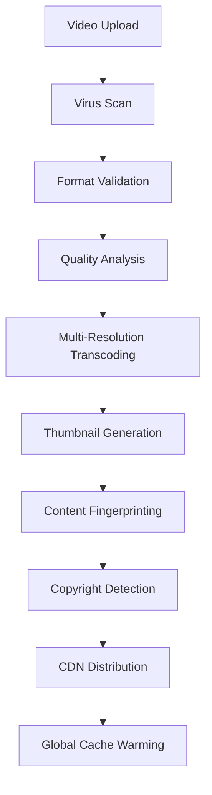

# Global CDN and Distribution Strategy
## VideoStream Pro - YouTube Alternative

### Overview
A comprehensive global content delivery network (CDN) strategy designed to compete with YouTube's global infrastructure, ensuring optimal video delivery worldwide with minimal latency.

## 1. Multi-CDN Architecture

### Primary CDN Providers
- **AWS CloudFront** (Global reach, tight S3 integration)
- **Cloudflare** (DDoS protection, edge computing)
- **Google Cloud CDN** (YouTube-like performance)
- **Azure CDN** (Enterprise features)
- **KeyCDN** (Cost-effective backup)

### CDN Selection Logic
```javascript
const cdnSelector = {
  primary: 'cloudfront',
  fallback: ['cloudflare', 'google-cdn', 'azure-cdn'],
  criteria: {
    latency: 'lowest',
    availability: '99.9%',
    bandwidth: 'unlimited',
    geoLocation: 'user_proximity'
  }
}
```

## 2. Global Edge Locations

### Tier 1 Regions (Ultra-Low Latency)
- **North America**: 
  - US East (Virginia, Ohio, Oregon)
  - US West (California, Oregon)
  - Canada (Central, East)
- **Europe**: 
  - Frankfurt, London, Paris, Amsterdam, Stockholm
- **Asia Pacific**: 
  - Tokyo, Singapore, Seoul, Mumbai, Sydney

### Tier 2 Regions (Standard Latency)
- **Americas**: Brazil, Mexico, Chile
- **Europe**: Milan, Madrid, Zurich, Dublin
- **Asia**: Hong Kong, Taiwan, Thailand, Indonesia
- **Middle East**: Dubai, Bahrain
- **Africa**: Cape Town, Lagos

### Tier 3 Regions (Acceptable Latency)
- Additional 50+ edge locations for comprehensive coverage

## 3. Video Delivery Optimization

### Adaptive Bitrate Streaming (ABR)
```yaml
video_qualities:
  ultra_low: "144p (200 kbps)"
  low: "240p (400 kbps)"
  medium: "360p (800 kbps)"
  standard: "480p (1.5 Mbps)"
  high: "720p (3 Mbps)"
  full_hd: "1080p (6 Mbps)"
  quad_hd: "1440p (12 Mbps)"
  ultra_hd: "2160p (25 Mbps)"
  ultra_hd_hdr: "2160p HDR (50 Mbps)"
  8k: "4320p (100 Mbps)"

protocols:
  hls: "HTTP Live Streaming (iOS/Safari)"
  dash: "Dynamic Adaptive Streaming (Chrome/Firefox)"
  mss: "Microsoft Smooth Streaming (Edge/IE)"
```

### Smart Caching Strategy
```javascript
const cachingRules = {
  hotContent: {
    ttl: '24 hours',
    criteria: ['trending', 'viral', 'high_engagement'],
    replicas: 'all_tier1_regions'
  },
  popularContent: {
    ttl: '7 days',
    criteria: ['subscriber_base > 100k', 'views > 1M'],
    replicas: 'regional_clusters'
  },
  standardContent: {
    ttl: '30 days',
    criteria: ['default'],
    replicas: 'origin_region_plus_2'
  },
  coldContent: {
    ttl: '90 days',
    criteria: ['views < 1k', 'uploaded > 6_months'],
    replicas: 'origin_only'
  }
}
```

## 4. Video Processing and Storage

### Multi-Region Storage Architecture
```yaml
storage_strategy:
  primary_regions:
    - us-east-1 (Virginia)
    - eu-west-1 (Ireland) 
    - ap-southeast-1 (Singapore)
  
  replication_rules:
    immediate: "Trending content (T1 regions)"
    delayed: "Popular content (T2 regions within 1 hour)"
    on_demand: "Standard content (T3 regions on first request)"
  
  storage_classes:
    hot: "Frequently accessed (0-30 days)"
    warm: "Occasionally accessed (30-90 days)"
    cold: "Rarely accessed (90+ days)"
    archive: "Long-term storage (1+ years)"
```

### Video Processing Pipeline


## 5. Performance Optimization

### Preloading Strategy
```javascript
const preloadingLogic = {
  user_preferences: {
    autoplay_next: true,
    quality_preference: 'auto',
    data_saver: false
  },
  
  preload_scenarios: {
    homepage: 'preload_first_3_thumbnails',
    video_page: 'preload_next_suggested_video',
    playlist: 'preload_next_2_videos',
    channel: 'preload_latest_video'
  },
  
  bandwidth_detection: {
    high: 'preload_1080p',
    medium: 'preload_720p',
    low: 'preload_480p',
    very_low: 'preload_360p'
  }
}
```

### Edge Computing Features
- **Edge Security**: DDoS protection, bot detection
- **Edge Analytics**: Real-time metrics collection
- **Edge Personalization**: User-specific content delivery
- **Edge Compression**: Brotli/Gzip compression
- **Edge Image Optimization**: WebP/AVIF conversion

## 6. Geographic Content Delivery

### Regional Content Strategy
```yaml
content_localization:
  language_detection: "Accept-Language header + IP geolocation"
  
  regional_preferences:
    north_america:
      default_quality: "1080p"
      preferred_codec: "H.264"
      subtitle_languages: ["en", "es", "fr"]
    
    europe:
      default_quality: "720p" 
      preferred_codec: "H.264"
      subtitle_languages: ["en", "de", "fr", "es", "it"]
    
    asia_pacific:
      default_quality: "480p"
      preferred_codec: "H.265"
      subtitle_languages: ["en", "zh", "ja", "ko", "hi"]
```

### Compliance and Regulations
- **GDPR** (Europe): Data protection and privacy
- **COPPA** (US): Children's privacy protection
- **PIPEDA** (Canada): Personal information protection
- **LGPD** (Brazil): Data protection law
- **Content Blocking**: Regional content restrictions

## 7. Analytics and Monitoring

### Real-Time Metrics
```javascript
const cdnMetrics = {
  performance: {
    cache_hit_ratio: '>95%',
    average_latency: '<50ms',
    bandwidth_utilization: '<80%',
    error_rate: '<0.1%'
  },
  
  user_experience: {
    video_start_time: '<2s',
    buffering_events: '<1 per session',
    quality_switches: 'minimal',
    playback_success_rate: '>99.5%'
  },
  
  business: {
    bandwidth_costs: 'optimized',
    regional_performance: 'tracked',
    content_popularity: 'analyzed',
    revenue_impact: 'measured'
  }
}
```

### Alerting System
- **Critical**: >1% error rate, >500ms latency
- **Warning**: >0.5% error rate, >200ms latency
- **Info**: Performance degradation, cache miss spikes

## 8. Cost Optimization

### Intelligent Traffic Routing
```javascript
const costOptimization = {
  routing_strategy: {
    peak_hours: 'prefer_cheaper_cdns',
    off_peak: 'prefer_performance_cdns',
    high_traffic: 'load_balance_across_cdns',
    emergency: 'route_to_available_cdns'
  },
  
  bandwidth_management: {
    popular_content: 'cache_aggressively',
    niche_content: 'cache_on_demand',
    archived_content: 'serve_from_origin'
  },
  
  regional_pricing: {
    tier1_regions: 'premium_pricing_acceptable',
    tier2_regions: 'balanced_cost_performance',
    tier3_regions: 'cost_optimized'
  }
}
```

## 9. Security Features

### DDoS Protection
- **Layer 3/4**: Network-level protection
- **Layer 7**: Application-level protection
- **Rate Limiting**: Per-IP and per-user limits
- **Bot Detection**: Automated traffic filtering

### Content Security
```yaml
security_measures:
  ssl_tls: "TLS 1.3 minimum"
  certificate_pinning: "enabled"
  token_authentication: "signed_urls_for_premium"
  geo_blocking: "configurable_per_content"
  hotlink_protection: "referrer_validation"
  secure_headers:
    - "X-Content-Type-Options: nosniff"
    - "X-Frame-Options: DENY"
    - "Strict-Transport-Security: max-age=31536000"
```

## 10. Implementation Roadmap

### Phase 1: Foundation (Months 1-3)
- Primary CDN integration (CloudFront)
- Basic multi-resolution streaming
- Core edge locations (Tier 1)
- Basic caching strategy

### Phase 2: Expansion (Months 4-6)
- Multi-CDN failover system
- Advanced caching rules
- Tier 2 edge locations
- Performance optimization

### Phase 3: Enhancement (Months 7-9)
- Edge computing features
- Advanced analytics
- Cost optimization
- Regional compliance

### Phase 4: Global Scale (Months 10-12)
- Tier 3 edge locations
- Advanced AI-driven optimization
- Full feature parity with YouTube
- Enterprise-grade reliability

## Success Metrics

### Technical KPIs
- **99.99%** global availability
- **<100ms** average latency worldwide
- **>95%** cache hit ratio
- **<0.01%** error rate

### Business KPIs
- **50%** reduction in bandwidth costs vs. single CDN
- **90%** user satisfaction with video quality
- **<2 seconds** average video start time
- **Global** content delivery capability

This CDN strategy ensures VideoStream Pro can deliver content globally with YouTube-level performance while maintaining cost efficiency and regulatory compliance.